# Crime Analytics — Classification & Ensemble Learning

> **Educational machine-learning project:** exploratory data analysis, a Naive Bayes classifier implemented from scratch, standard classifiers, and a hard-voting ensemble for binary classification.

## Overview

This project studies a tabular classification problem in which the target variable `Possibility` is encoded as:

- `0` → `<= 0.5`
- `1` → `> 0.5`

The workflow combines exploratory data analysis (EDA), preprocessing, a custom Naive Bayes implementation, library-based classifiers, and a manually implemented hard-voting ensemble.

The accompanying report describes the work as classification of potential criminal behavior. Because this is a sensitive/high-impact application area, the models in this repository should be treated as an **academic demonstration only**, not as a system for real-world criminal profiling, investigation, or decision-making.

---

## Key Highlights

- Performed EDA on demographic, occupational, and numerical attributes.
- Handled missing values using mode/mean imputation.
- Removed `capitalgain` and `capitalloss` because they are zero for most records.
- Investigated numerical and categorical outliers using IQR/frequency-based rules.
- Encoded categorical features with `LabelEncoder`.
- Implemented **Naive Bayes from scratch** using NumPy/Pandas-style data structures and manual probability calculations.
- Compared the custom implementation with:
  - Gaussian Naive Bayes
  - Support Vector Machine (SVM)
  - Decision Tree
  - K-Nearest Neighbors (KNN)
- Implemented an ensemble classifier using **hard majority voting**, without an ensemble library.
- Evaluated models using accuracy, precision, recall, and F1 score.

---

## Methodology

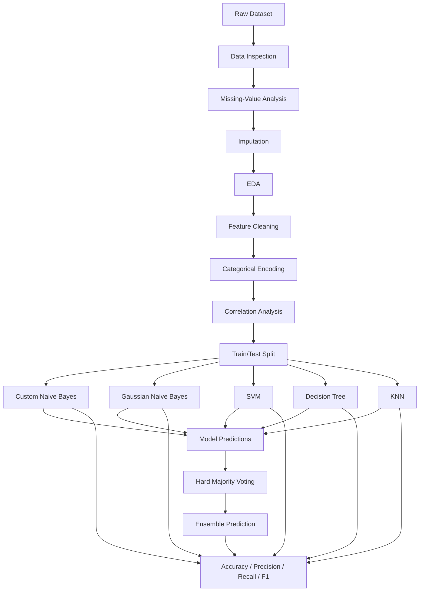

### 1. Data inspection and preprocessing

The notebook first inspects the dataset structure, missing values, duplicate rows, and basic statistics.

Missing values are handled as follows:

| Feature type | Strategy |
|---|---|
| Categorical | Mode imputation |
| Numerical | Mean imputation |

The implementation specifically fills missing values in `maritalstatus`, `race`, and `sex` using their modes and `hoursperweek` using its mean.

`capitalgain` and `capitalloss` are removed because the analysis found that they contain zeros for the vast majority of the 30,161 records:

- `capitalgain`: 27,623 zero entries
- `capitalloss`: 28,765 zero entries

### 2. Exploratory Data Analysis

The report contains visual analysis of:

- Sex distribution
- Target (`Possibility`) distribution
- Marital-status distribution
- Relationship distribution
- Race distribution
- Workclass distribution
- Age distribution
- Education-number distribution
- Capital-gain distribution
- Capital-loss distribution
- Hours-per-week distribution
- Feature correlation matrix

The report's EDA figures show a substantial class imbalance in the target: approximately **75.1%** of records are `<= 0.5`, while **24.9%** are `> 0.5`.

The sex distribution is approximately **68% male** and **32% female**.

### 3. Outlier analysis

Numerical outliers are detected using the IQR rule:

```text
Lower bound = Q1 - 1.5 × IQR
Upper bound = Q3 + 1.5 × IQR
```

Categorical values occurring below the chosen frequency threshold are also flagged.

A row is marked for removal when the number of flagged columns exceeds the defined 70% threshold.

> **Implementation note:** the current notebook creates `df_cleaned`, but the subsequent modeling dataframe is created from `df.copy()` rather than `df_cleaned`. Therefore, the detected outlier rows are **not actually used in the final modeling pipeline**.

### 4. Feature encoding

The implementation uses `LabelEncoder` for:

```text
workclass
education
maritalstatus
occupation
relationship
race
sex
native
```

The target is converted with:

```text
<=0.5 → 0
>0.5  → 1
```

The report describes one-hot encoding for nominal variables, but the supplied implementation actually uses label encoding. This README documents the **implemented code**.

---

## Custom Naive Bayes

The project implements Naive Bayes manually rather than calling a ready-made Naive Bayes estimator.

### Training

The custom classifier calculates:

1. Class priors
2. Feature likelihoods
3. Per-class means
4. Per-class variances for numerical handling

The implementation adds a small variance constant (`1e-6`) to improve numerical stability.

### Prediction

For each sample, the classifier:

1. Computes the log prior probability.
2. Accumulates log likelihoods.
3. Uses smoothing (`1e-6`) when an unseen feature value is encountered.
4. Uses a Gaussian probability-density expression for numerical features.
5. Selects the class with the largest resulting log probability.


This provides an educational view of how Naive Bayes works internally instead of hiding the computation behind a library call.

---

## Models Evaluated

| Model | Accuracy | Precision | Recall | F1 |
|---|---:|---:|---:|---:|
| **Ensemble Model** | **0.81** | 0.64 | 0.60 | 0.62 |
| Custom Naive Bayes | 0.80 | 0.58 | **0.75** | **0.66** |
| SVM | 0.80 | **0.72** | 0.36 | 0.48 |
| KNN | 0.79 | 0.61 | 0.56 | 0.58 |
| Decision Tree | 0.78 | 0.57 | 0.55 | 0.56 |
| Gaussian Naive Bayes | 0.76 | 0.53 | 0.70 | 0.60 |

These values are the final comparison values reported by the project/code. The report presents the same overall comparison on pages 5–6.

### Performance comparison

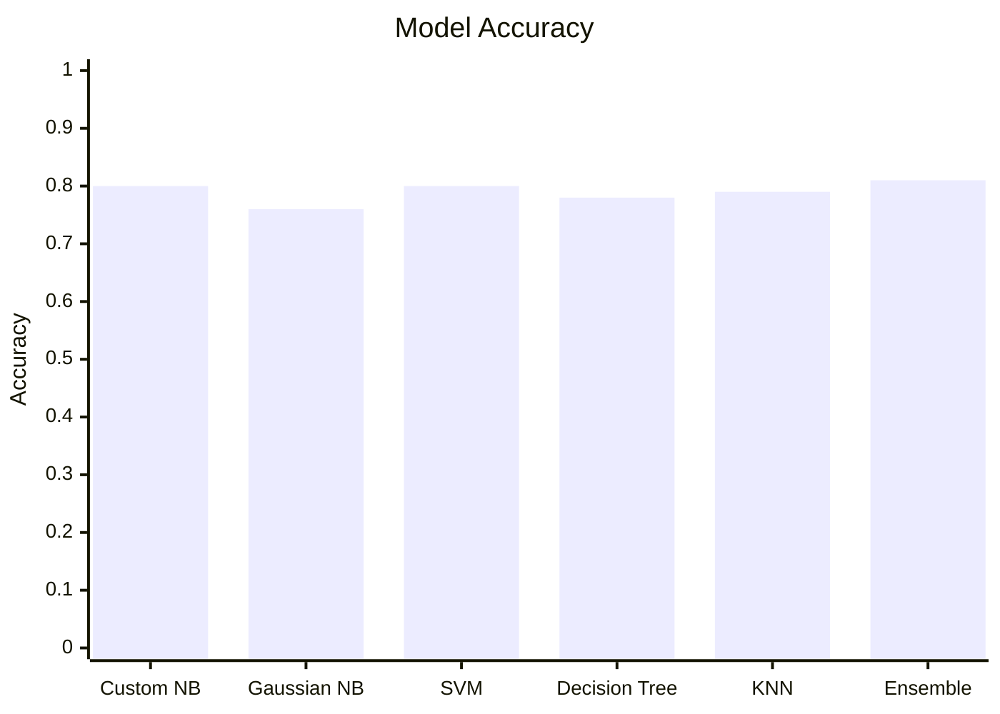

---


### Report Figures

The repository can preserve the original report visuals under `docs/figures/`:

#### Dataset distributions

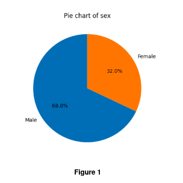

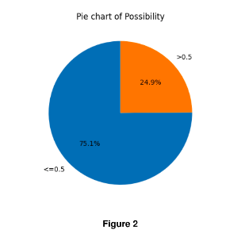


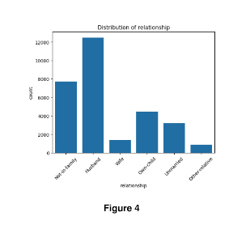

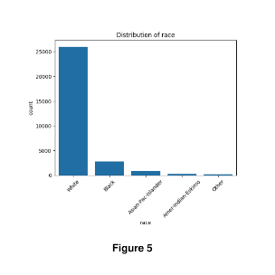

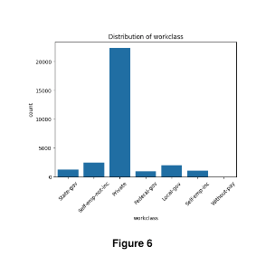

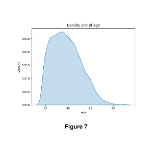

#### Numerical distributions and correlation

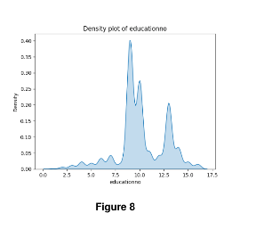

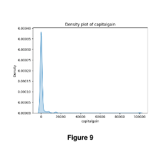

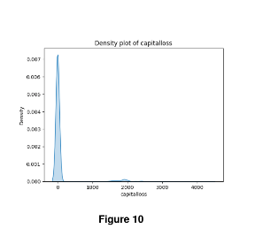

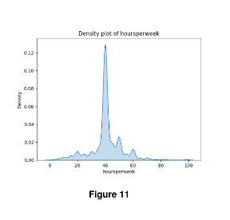

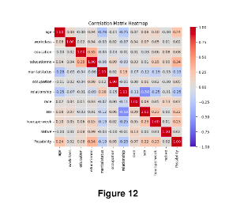


## Results Analysis

### Ensemble Model

The manually implemented hard-voting ensemble achieves the **highest reported accuracy: 0.81**.

It combines predictions from:

- Custom Naive Bayes
- Gaussian Naive Bayes
- SVM
- Decision Tree
- KNN

For every test sample, the ensemble selects the class receiving the majority of model predictions.

Its performance is:

```text
Accuracy  : 0.81
Precision : 0.64
Recall    : 0.60
F1 Score  : 0.62
```

The main advantage is that different classifiers contribute different decision behaviors, reducing dependence on one individual model.

### Custom Naive Bayes

The custom Naive Bayes model achieves:

```text
Accuracy  : 0.80
Precision : 0.58
Recall    : 0.75
F1 Score  : 0.66
```

Its most notable characteristic is its **0.75 recall**, which is the highest recall among the reported models. Its F1 score of **0.66** is also the highest in the final comparison.

This means the custom model is particularly effective at capturing positive cases, although it sacrifices precision relative to SVM.

### SVM

SVM has the **highest precision: 0.72**, but its recall is only **0.36**.

This indicates a strong tendency to be precise when predicting the positive class, while missing a larger proportion of actual positive cases.

### Gaussian Naive Bayes

The library-based GaussianNB records:

```text
Accuracy  : 0.76
Precision : 0.53
Recall    : 0.70
F1 Score  : 0.60
```

It provides relatively high recall but the lowest accuracy and precision among the compared models.

### Decision Tree and KNN

Decision Tree achieves 0.78 accuracy and KNN achieves 0.79 accuracy. Both provide more balanced precision/recall behavior than SVM, but neither exceeds the ensemble in overall accuracy.

---

## Custom vs Library Naive Bayes

The report also compares the custom implementation with `GaussianNB`.

| Implementation | Accuracy | Precision | Recall | F1 |
|---|---:|---:|---:|---:|
| Custom Naive Bayes | **0.80** | **0.58** | **0.75** | **0.66** |
| GaussianNB | 0.76 | 0.53 | 0.70 | 0.60 |

The custom implementation performs better on all four reported metrics.

The important distinction is that the custom implementation exposes the internal probability calculations, while `GaussianNB` provides an optimized, library-managed implementation.

---

## Visualizations from the Report

The supplied report contains the project's EDA and correlation figures.

### Target and demographic distributions

The report's page 2 figures show:

- `Possibility` is imbalanced, with 75.1% in the `<=0.5` class.
- The dataset contains approximately 68% male and 32% female records.
- `relationship`, `race`, `workclass`, and `maritalstatus` are highly unevenly distributed.

### Numerical distributions

The report's page 3 figures visualize the distributions of:

- `educationno`
- `capitalgain`
- `capitalloss`
- `hoursperweek`

These distributions motivated additional inspection of skewness and outliers.

### Correlation analysis

The correlation heatmap in Figure 12 examines relationships between encoded features and the target. The report concludes that no pair of columns exhibits a strong positive or negative correlation.

---

## Project Structure

A recommended repository structure is:

```text
.
├── README.md
├── code.py
├── data/
│   └── Dataset - missing_values-SalaryData_Train.csv
├── docs/
│   └── figures/
├── requirements.txt
└── report/
    └── Report_Assignment1.pdf
```

The current uploaded implementation is contained in `code.py`, while the accompanying analysis and results are documented in `Report_Assignment1.pdf`.

---

## Installation

### Requirements

```text
Python 3.x
pandas
numpy
matplotlib
seaborn
scikit-learn
```

Install dependencies with:

```bash
pip install pandas numpy matplotlib seaborn scikit-learn
```

---

## Running the Project

1. Place the dataset at the path expected by the notebook/code.
2. Run `code.py` or transfer the notebook cells into Google Colab/Jupyter.
3. Execute preprocessing and EDA.
4. Train the individual classifiers.
5. Evaluate accuracy, precision, recall, and F1.
6. Run the hard-voting ensemble.
7. Compare the resulting metrics.

The original notebook also contains a Google Colab version of the implementation.

---

## Important Implementation Observations

A close review of the supplied code reveals several details worth knowing before extending the repository:

### 1. Outlier-cleaned dataframe is not used

The code creates:

```python
df_cleaned = df[~rows_to_remove]
```

but later creates:

```python
df_new = df.copy()
```

Therefore, the final models use `df`, not `df_cleaned`.

### 2. All encoded features become numeric

After `LabelEncoder`, categorical columns are represented by integers. The custom Naive Bayes implementation subsequently checks numerical types, so the distinction between originally categorical and numerical variables is not preserved in the final NumPy matrix.

This is important when interpreting the custom Naive Bayes implementation: it is an educational hybrid implementation, but it does not maintain explicit feature-type metadata after encoding.

### 3. Evaluation protocols are not identical in every section

The custom Naive Bayes model is initially evaluated on the training data in the notebook, while the final model comparison trains it on the training split and evaluates it on the test split.

For a fair benchmark, the **test-set comparison** should be treated as the relevant result.

### 4. Target imbalance matters

The target distribution is approximately 75.1% / 24.9%. Consequently, accuracy alone is not sufficient to judge model quality. Precision, recall, and F1 are important for understanding the positive-class behavior.

---

## Conclusion

The project demonstrates a complete classical machine-learning workflow from data inspection and EDA through preprocessing, model development, comparison, and ensemble learning.

The main findings are:

1. **The hard-voting ensemble achieves the highest reported accuracy (0.81).**
2. **Custom Naive Bayes has the highest reported recall (0.75) and F1 score (0.66).**
3. **SVM has the highest precision (0.72), but its recall is substantially lower (0.36).**
4. The custom Naive Bayes implementation outperforms the reported GaussianNB implementation across accuracy, precision, recall, and F1.
5. The ensemble demonstrates that combining diverse classifiers can improve overall accuracy, but the best model depends on the metric that matters most.
6. Because the dataset is imbalanced and the target represents a sensitive real-world concept, the reported metrics should be interpreted cautiously.

Overall, this repository is best viewed as a **machine-learning and ensemble-methods study** demonstrating how different classification strategies behave on the same tabular dataset, rather than as a deployable criminal-risk prediction system.

---

## Authors

- Nagalla Devisri Prasad
- Darapu Adhithya Shiva Kumar Reddy
- Eeshwar Aditya

## Reference

The implementation and conclusions in this README are based on the supplied project report and source code.
